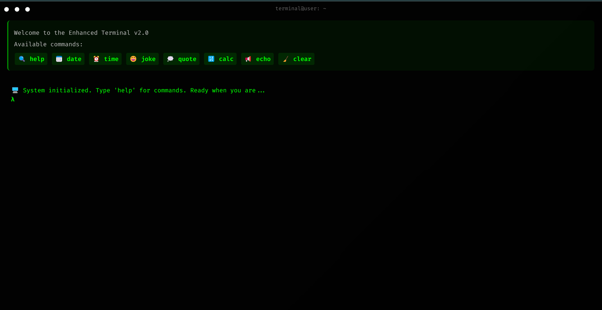

# The Terminal 💻

A modern, interactive terminal interface built with React and TypeScript, featuring a sleek design and various useful commands.



## 🌟 Live Preview

Check out the live demo: [The Terminal](https://rahasib.github.io/TheTerminal/)

## 🌟 Features

- 🎨 Beautiful UI with retro-terminal aesthetics
- 🌓 Dark mode optimized interface
- 💫 Smooth animations and transitions
- 📱 Fully responsive design
- 🔧 Multiple built-in commands

### Available Commands

- 🔍 `help` - Show all available commands
- 📅 `date` - Display current date and time
- ⏰ `time` - Show time in different formats
- 😄 `joke` - Get a random dad joke
- 💭 `quote` - Get an inspiring quote
- 🔢 `calc` - Calculate mathematical expressions
- 📢 `echo` - Echo back your text
- 🧹 `clear` - Clear the terminal

## 🚀 Getting Started

### Prerequisites

- Node.js (v14 or higher)
- npm or yarn
- Git

### Installation

1. Clone the repository:
```bash
git clone https://github.com/RaHasib/TheTerminal.git
cd TheTerminal
```

2. Install dependencies:
```bash
npm install
# or
yarn install
```

3. Create a `.env` file in the root directory:
```env
VITE_JOKE_API_URL=your_joke_api_url
VITE_QUOTE_API_URL=your_quote_api_url
VITE_BACKUP_QUOTE_API_URL=your_backup_quote_api_url
```

4. Start the development server:
```bash
npm run dev
# or
yarn dev
```

## 📤 Deployment

### GitHub Pages Deployment

1. Install the `gh-pages` package:
```bash
npm install --save-dev gh-pages
# or
yarn add -D gh-pages
```

2. Add deployment scripts to your `package.json`:
```json
{
  "scripts": {
    "predeploy": "npm run build",
    "deploy": "gh-pages -d dist"
  }
}
```

3. Deploy to GitHub Pages:

```bash
# First, build your project
npm run build
# or
yarn build

# Then deploy
npm run deploy
# or
yarn deploy
```

Your app will be available at: `https://yourusername.github.io/TheTerminal`

## 🛠️ Built With

- [React](https://reactjs.org/) - Frontend framework
- [TypeScript](https://www.typescriptlang.org/) - Programming language
- [Vite](https://vitejs.dev/) - Build tool
- [PrimeReact](https://primereact.org/) - UI Component library
- [Fira Code](https://github.com/tonsky/FiraCode) - Monospace font

## 📦 Project Structure

```
src/
├── Components/
│   └── CommandLine/
│       ├── components/
│       │   ├── Header/
│       │   └── TitleBar/
│       ├── constants/
│       ├── handlers/
│       ├── hooks/
│       ├── styles/
│       └── CommandLine.tsx
├── services/
│   └── api.ts
├── App.tsx
└── main.tsx
```

## 🎨 Customization

### Styling
The terminal's appearance can be customized by modifying the CSS files in:
- `src/Components/CommandLine/styles/`
- `src/index.css`

### Adding New Commands
1. Add command definition in `src/Components/CommandLine/constants/commands.ts`
2. Implement handler in `src/Components/CommandLine/handlers/commandHandlers.ts`
3. Add the command case in `src/Components/CommandLine/hooks/useCommandLine.ts`

## 🤝 Contributing

1. Fork the repository
2. Create your feature branch (`git checkout -b feature/AmazingFeature`)
3. Commit your changes (`git commit -m 'Add some AmazingFeature'`)
4. Push to the branch (`git push origin feature/AmazingFeature`)
5. Open a Pull Request

## 📝 License

This project is licensed under the MIT License - see the [LICENSE](LICENSE) file for details.

## 🙏 Acknowledgments

- Inspired by retro terminal interfaces
- Icons provided by native emoji support
- Quote API services
- Dad joke API service
